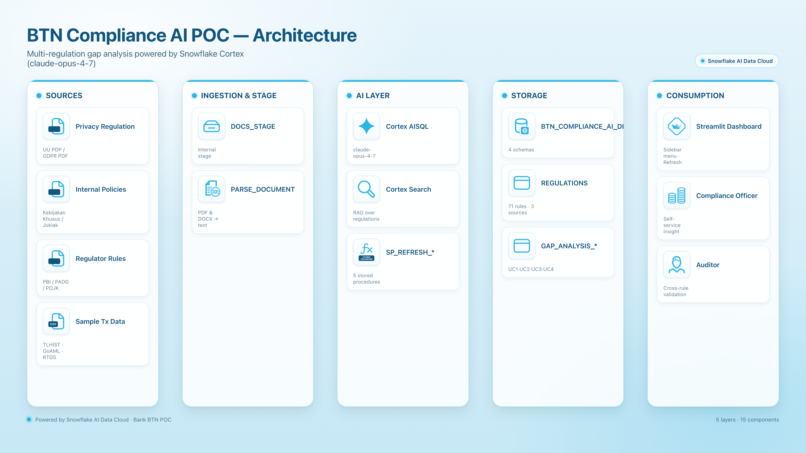

# Compliance AI Analysis — Snowflake Cortex POC

End-to-end **multi-regulation compliance gap analysis** using Snowflake Cortex AI.
The platform parses regulatory documents (PDF / DOCX), classifies sensitive table
columns with an LLM, and produces actionable compliance gap insights via a
Streamlit-in-Snowflake dashboard.

> Originally built as a Bank ABC POC. The pattern works for any bank / FSI that
> needs to compare its data and internal policies against external regulations
> (e.g., UU PDP, GDPR, PCI-DSS, regulator circulars).

---

## Architecture



| Layer | Components |
|---|---|
| **Sources** | Privacy regulation PDF, internal policies (DOCX), regulator rules (PDF), sample transaction data (CSV) |
| **Ingestion & Stage** | Internal stage `DOCS_STAGE` + `SNOWFLAKE.CORTEX.PARSE_DOCUMENT` to extract text from PDF & DOCX |
| **AI Layer** | Cortex AISQL (`claude-opus-4-7`) for classification & gap reasoning, Cortex Search for RAG, 5 Stored Procedures to make the pipeline idempotent |
| **Storage** | One database, four schemas: `CUSTOMER_DATA`, `TRANSACTION_DATA`, `COMPLIANCE_DOCS`, `COMPLIANCE_RESULTS` |
| **Consumption** | Streamlit dashboard with sidebar menu, multi-tab insights per use case, and a "Refresh" button per UC |

---

## Use Cases

| # | Title | Question answered |
|---|---|---|
| **UC1** | Customer / PII vs Privacy Regulation | Are our PII columns protected as required (encryption, masking, retention, consent)? |
| **UC2** | Transactions vs Internal Policies | Do our 3 transaction tables follow the bank's own internal policies? |
| **UC3** | Transactions vs Regulator Rules | Do those same tables comply with external regulator requirements (PBI / PADG / POJK / similar)? |
| **UC4** | Internal Policies vs Regulator | Where do our internal policies fall short of, or duplicate, the regulator's expectations? |

Each UC produces:
- A **risk overview** (counts by status: COMPLIANT / GAP / PARTIAL)
- A **rule-by-rule gap report** with severity
- An **AI-generated executive summary**
- **Tab views**: Overview · Rule Coverage · Column Heatmap · Action Plan · Raw Findings

---

## Repository Layout

```
compliance-ai-analysis/
├── diagrams/
│   ├── architecture.png            # rendered architecture diagram
│   └── architecture_spec.yaml      # source spec for the diagram renderer
├── sql/
│   ├── 01_data_setup.sql           # database, schemas, tables, synthetic data
│   ├── 02_parse_documents.sql      # PARSE_DOCUMENT for PDF + DOCX → text
│   ├── 03_ai_classification.sql    # AI column classification (PII / sensitive / risk)
│   ├── 04_gap_analysis.sql         # 4 gap-analysis result tables (UC1–UC4)
│   └── 05_refresh_stored_procedures.sql   # idempotent SP_REFRESH_* procedures
├── streamlit/
│   ├── abc_compliance_dashboard.py # Streamlit-in-Snowflake app (sidebar menu, 5 tabs/UC, refresh button)
│   └── environment.yml             # Streamlit-in-Snowflake conda env
├── .gitignore
└── README.md
```

> The actual regulatory PDF/DOCX and transaction CSV files are **not** committed.
> Use your own copies and reference them as `pdf1.pdf`, `pdf2.pdf`, `policy1.docx`, etc.

---

## Prerequisites

- Snowflake account with **Cortex enabled** in your region
- **claude-opus-4-7** (or `claude-4-sonnet`) available via `SNOWFLAKE.CORTEX.COMPLETE`
- Role with `ACCOUNTADMIN` or equivalent (CREATE DATABASE, CREATE WAREHOUSE, CREATE STAGE, CREATE STREAMLIT, USAGE on `SNOWFLAKE.CORTEX`)
- Local files ready to upload:
  - `pdf1.pdf` — privacy regulation (e.g., UU PDP / GDPR)
  - `policy1.docx`, `policy2.docx` — internal policies
  - `pdf2.pdf`, `pdf3.pdf`, `pdf4.pdf` — regulator circulars
  - (optional) `tx1.csv`, `tx2.csv`, `tx3.csv` — sample transactions if you don't want to use the synthetic data generator

---

## Step-by-step setup

### Step 1 — Create database, warehouse, schemas, tables

```sql
-- Run sql/01_data_setup.sql
-- Creates:
--   DB:  COMPLIANCE_AI_DEMO
--   WH:  COMPLIANCE_POC (XS, auto-suspend 60s)
--   Schemas: CUSTOMER_DATA, TRANSACTION_DATA, COMPLIANCE_DOCS, COMPLIANCE_RESULTS
--   Tables:  customer master, accounts, credit cards, loan applications,
--            and 3 transaction tables (10K synthetic rows each)
```

> The script uses `TABLE(GENERATOR(...))` + `UNIFORM` to build synthetic data — no
> sensitive customer data needed for the POC.

### Step 2 — Upload regulatory documents

Create a stage and `PUT` your PDFs/DOCX:

```sql
USE SCHEMA COMPLIANCE_AI_DEMO.COMPLIANCE_DOCS;

CREATE OR REPLACE STAGE DOCS_STAGE
  DIRECTORY = (ENABLE = TRUE)
  ENCRYPTION = (TYPE = 'SNOWFLAKE_SSE');
```

From SnowSQL or Snowflake CLI:

```bash
snow sql -q "PUT file:///local/path/pdf1.pdf @COMPLIANCE_DOCS.DOCS_STAGE OVERWRITE=TRUE AUTO_COMPRESS=FALSE"
snow sql -q "PUT file:///local/path/policy1.docx @COMPLIANCE_DOCS.DOCS_STAGE OVERWRITE=TRUE AUTO_COMPRESS=FALSE"
# repeat for pdf2.pdf, pdf3.pdf, pdf4.pdf, policy2.docx
```

### Step 3 — Parse PDFs / DOCX into text

```sql
-- Run sql/02_parse_documents.sql
-- Uses SNOWFLAKE.CORTEX.PARSE_DOCUMENT(@DOCS_STAGE, '<file>', {'mode':'LAYOUT'})
-- Stores extracted text per document in COMPLIANCE_DOCS.DOC_CONTENT
```

### Step 4 — Seed regulations table

The script `04_gap_analysis.sql` (and the SP refresh SQL) expect a `REGULATIONS`
table with three sources tagged in a single `REGULATION_SOURCE` column:

| REGULATION_SOURCE | Meaning |
|---|---|
| `PRIVACY_LAW`     | Privacy regulation (UU PDP / GDPR) |
| `INTERNAL_POLICY` | Internal bank policies |
| `REGULATOR_RULE`  | Regulator circulars (PBI / PADG / POJK / etc.) |

You can either:
- **Manually curate rules** (recommended for high accuracy) — extract rule text + category from the parsed content and INSERT into `REGULATIONS`, or
- **Auto-extract** by prompting `CORTEX.COMPLETE(claude-opus-4-7, '...extract rules as JSON ...', parsed_text)` and exploding the JSON.

### Step 5 — Run AI column classification

```sql
-- Run sql/03_ai_classification.sql
-- Classifies every column across customer + transaction tables:
--   IS_PII, IS_FINANCIAL, NEED_MASKING, NEED_ENCRYPTION, RISK_LEVEL, REASONING
-- Stored in COMPLIANCE_RESULTS.COLUMN_CLASSIFICATION
```

### Step 6 — Run gap analysis (UC1–UC4)

```sql
-- Run sql/04_gap_analysis.sql
-- Produces 4 tables in COMPLIANCE_RESULTS:
--   UC1_GAP_ANALYSIS  (PII vs Privacy Regulation)
--   UC2_GAP_ANALYSIS  (Transactions vs Internal Policy)
--   UC3_GAP_ANALYSIS  (Transactions vs Regulator Rule)
--   UC4_GAP_ANALYSIS  (Internal Policy vs Regulator Rule)
```

### Step 7 — Create the refresh stored procedures

```sql
-- Run sql/05_refresh_stored_procedures.sql
-- Creates 5 idempotent procedures the dashboard's "Refresh" button can call:
--   SP_REFRESH_AI_CLASSIFICATION
--   SP_REFRESH_UC1
--   SP_REFRESH_UC2
--   SP_REFRESH_UC3
--   SP_REFRESH_UC4
```

### Step 8 — Deploy the Streamlit dashboard

```sql
USE SCHEMA COMPLIANCE_AI_DEMO.COMPLIANCE_DOCS;

CREATE OR REPLACE STAGE STREAMLIT_STAGE
  DIRECTORY = (ENABLE = TRUE)
  ENCRYPTION = (TYPE = 'SNOWFLAKE_SSE');
```

Upload the app + env file:

```bash
snow sql -q "PUT file:///local/path/streamlit/abc_compliance_dashboard.py @STREAMLIT_STAGE OVERWRITE=TRUE AUTO_COMPRESS=FALSE"
snow sql -q "PUT file:///local/path/streamlit/environment.yml @STREAMLIT_STAGE OVERWRITE=TRUE AUTO_COMPRESS=FALSE"
```

Create the Streamlit object:

```sql
CREATE OR REPLACE STREAMLIT COMPLIANCE_DASHBOARD
  ROOT_LOCATION = '@COMPLIANCE_AI_DEMO.COMPLIANCE_DOCS.STREAMLIT_STAGE'
  MAIN_FILE = 'abc_compliance_dashboard.py'
  QUERY_WAREHOUSE = COMPLIANCE_POC
  TITLE = 'Compliance AI Dashboard';
```

Open it from Snowsight → **Projects → Streamlit → COMPLIANCE_DASHBOARD**.

### Step 9 — Use the dashboard

Sidebar menu:
1. **Summary** — KPIs across all 4 UCs
2. **UC1 — Privacy Regulation** — PII gap analysis
3. **UC2 — Internal Policy** — Transactions vs internal rules
4. **UC3 — Regulator Rule** — Transactions vs regulator
5. **UC4 — Policy vs Regulator** — Cross-coverage analysis

Each UC has 5 tabs (Overview / Rule Coverage / Column Heatmap / Action Plan / Raw Findings) and a **Refresh** button that calls the corresponding stored procedure to re-run the analysis with the latest data.

---

## Customisation

- **AI model**: change `claude-opus-4-7` to any model available in `SNOWFLAKE.CORTEX.COMPLETE` (e.g., `claude-4-sonnet`, `mistral-large2`).
- **Brand colors**: edit the `BRAND_*` constants at the top of `abc_compliance_dashboard.py`.
- **Regulation sources**: add a new value to `REGULATION_SOURCE` and create a matching `SP_REFRESH_UC*` stored procedure.
- **Languages**: prompts are written in Bahasa Indonesia + English; adjust the prompt strings in `sql/03_*` and `sql/04_*` if you need a different language.

---

## Troubleshooting

| Symptom | Fix |
|---|---|
| `Packages not found: python==3.11` when creating Streamlit | Remove the `python` line from `environment.yml` — Streamlit-in-Snowflake picks the runtime automatically |
| `PARSE_DOCUMENT` fails on a DOCX | Make sure file uploaded with `AUTO_COMPRESS=FALSE` |
| `CORTEX.COMPLETE` returns markdown-fenced JSON (```json ... ```) | The SP refresh scripts already strip fences via `REGEXP_REPLACE` before `TRY_PARSE_JSON` |
| Combinatorial blow-up in cross-comparison | UC4 uses heuristic JOIN filters (e.g., only check ENCRYPTION rules vs `NEED_MASKING = TRUE` columns) — keep them when you adapt |

---

## License

Internal POC code. Do not commit any real customer data, regulatory PDFs, or
internal policy documents to this repository — `.gitignore` already excludes
`*.pdf`, `*.docx`, `*.csv`, `*.xlsx`.
